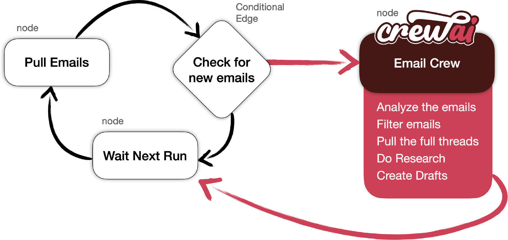

# InboxWatch-AI## Tech Stack
- **CrewAI**: Manages AI agents that work together
- **LangGraph**: Controls the workflow between different steps
- **Gmail API**: Reads emails and creates drafts
- **Tavily Search**: Web search for additional context
- **Python**: Main programming language

## Setup Instructions

### 1. Install Dependencies
```bash
pip install -r requirements.txt
```

### 2. Setup Gmail API
1. Go to [Google Cloud Console](https://console.cloud.google.com/)
2. Create a new project or select existing one
3. Enable Gmail API
4. Create credentials (OAuth 2.0 client ID)
5. Download the credentials file and rename it to `credentials.json`
6. Put `credentials.json` in the project root folder

### 3. Environment Variables
Create a `.env` file with:
```
OPENAI_API_KEY=your_openai_api_key
TAVILY_API_KEY=your_tavily_api_key
MY_EMAIL=your_email@gmail.com
```

### 4. Run the Application
```bash
python main.py
```Does
This project automatically checks your Gmail inbox for new emails and creates draft responses for emails that need action. It uses AI agents to filter emails and write responses.

## How It Works
1. **Email Checker**: Looks for new emails in your Gmail
2. **Email Filter**: AI agent decides which emails need action
3. **Response Writer**: AI agent writes draft responses
4. **Gmail Integration**: Creates drafts in your Gmail account




By Giridhar Palla (@giridharpalla)

- [CrewAI Framework](#crewai-framework)
- [Running the code](#running-the-code)
- [Details & Explanation](#details--explanation)
- [Using Local Models with Ollama](#using-local-models-with-ollama)
- [License](#license)

## CrewAI Framework
CrewAI is designed to facilitate the collaboration of role-playing AI agents. In this example, these agents work together to give a complete stock analysis and investment recommendation

## Running the Code
This example uses GPT-4.

- **Configure Environment**: Copy ``.env.example` and set up the environment variable
- **Setup a credentials.json**: Follow the [google instructions](https://developers.google.com/gmail/api/quickstart/python#authorize_credentials_for_a_desktop_application), once you’ve downloaded the file, name it `credentials.json` and add to the root of the project,
- **Install Dependencies**: Run `pip install -r requirements.txt` (includes crewAI==0.130.0)
- **Execute the Script**: Run `python main.py`

## Project Structure
```
├── main.py                 # Main application entry point
├── src/
│   ├── graph.py           # LangGraph workflow definition
│   ├── nodes.py           # Individual workflow functions
│   ├── state.py           # Data structure for workflow state
│   └── crew/
│       ├── agents.py      # AI agent definitions
│       ├── tasks.py       # Tasks for AI agents
│       ├── crew.py        # CrewAI team configuration
│       └── tools.py       # Custom tools for agents
├── requirements.txt       # Python dependencies
├── credentials.json       # Gmail API credentials (you create this)
└── README.md             # This file
```

## What Each AI Agent Does

### Email Filter Agent
- Reads new emails
- Decides if email needs action
- Filters out spam, newsletters, promotional emails

### Email Action Agent
- Gets full email content for important emails
- Uses web search for context if needed
- Identifies what action is required

### Email Response Writer
- Writes professional draft responses
- Uses context from email content
- Creates drafts in Gmail

## Requirements
- Python 3.11+
- OpenAI API key
- Tavily API key
- Gmail account with API access
- Internet connection

## Notes
- The app checks for emails from the last 24 hours
- It waits 3 minutes between checks
- Drafts are saved to your Gmail drafts folder
- Your own emails are ignored

## Troubleshooting
- Make sure `credentials.json` is in the root folder
- Check that all API keys are correct in `.env` file
- Ensure Gmail API is enabled in Google Cloud Console
- Run `pip install -r requirements.txt` if you get import errors

## Author
Created by Giridhar Palla (@giridharpalla)
